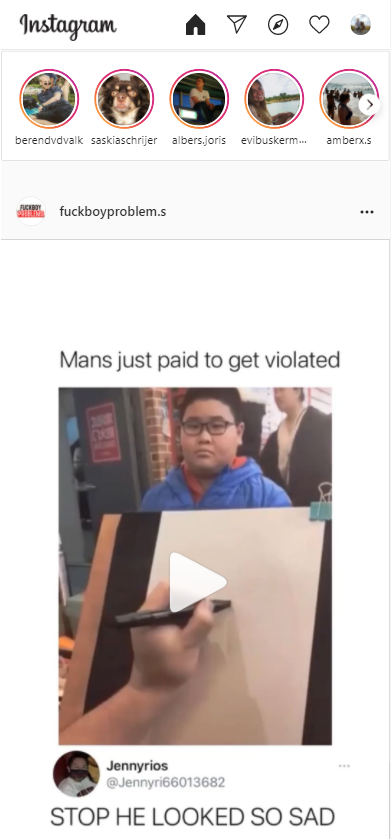
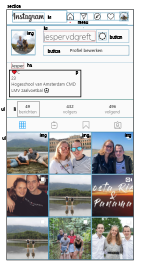

# Procesverslag
**Auteur:** -Jesper van der Greft-

Markdown cheat cheet: [Hulp bij het schrijven van Markdown](https://github.com/adam-p/markdown-here/wiki/Markdown-Cheatsheet). Nb. de standaardstructuur en de spartaanse opmaak zijn helemaal prima. Het gaat om de inhoud van je procesverslag. Besteedt de tijd voor pracht en praal aan je website.

## Bronnenlijst
1. -https://stackoverflow.com/questions/5706963/possible-to-use-border-radius-together-with-a-border-image-which-has-a-gradient-
2. -https://www.instagram.com/-
3. -...-

## Eindgesprek (week 7/8)

-dit ging goed & dit was lastig-

**Screenshot(s):**

-screenshot(s) van je eindresultaat-

## Voortgang 3 (week 6)

-same as voortgang 1-

## Voortgang 2 (week 5)

-same as voortgang 1-

## Voortgang 1 (week 3)

### Stand van zaken

-dit ging goed & dit was lastig-
Ik vond het lastig om te beginnen met mijn html structuur te geven, het is een hele tijd geleden dat ik
een website heb gemaakt vanaf 0. Na de eerste feedback van mijn eerste html structuur kreeg ik ook gelijk te
horen dat ik moet proberen om niet met classes te werken, ik had dit op internet gezien omdat het daar veel wordt
gebruikt maar inderdaad dit is niet handig. Ik ben mijn html gaan aanpassen a.d.h.v feedback en mijn nieuwe structuur
is veel overzichtelijker en netter.
Toen mijn html goed stond wilde ik ook beginnen met de css, met de hulp van de gemaakte huiswerk opdrachten wist ik nu
hoe ik elementen kon selecteren a.d.h.v selectoren zoals first-of-type.
Ik ben erg blij met mijn eerste voortgang omdat ik toch als best veel voor elkaar heb gekregen in een korte tijd.

**Screenshot(s):**

-screenshot(s) van hoe ver je bent-

### Agenda voor meeting

-samen met je groepje opstellen-
Ik heb het idee dat ik helemaal geen groepje heb omdat alle mensen die bij mij zitten nooit aanwezig zijn geweest denk ik.

### Verslag van meeting

-na afloop snel uitkomsten vastleggen-

## Intake (week 1)

**Je startniveau: blauw**

**Je focus: surface plane**

**Je opdracht: https://www.instagram.com/** 

**Screenshot(s):**

&

**Breakdown-schets(en):**

